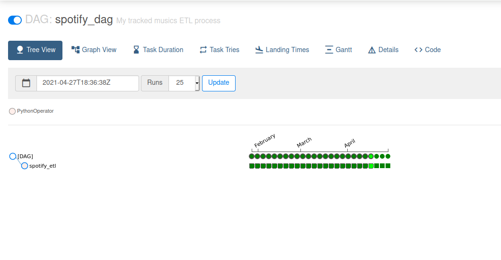

<!-- PROJECT LOGO -->
<br />
<p align="center">
  <a href="https://github.com/marcosfpr/spotify-etl">
    
  </a>

  <h3 align="center">Spotify ETL</h3>

  <p align="center">
    Simple Spotify ETL using Airflow and PostgreSQL.
    <br />
    <a href="https://github.com/marcosfpr/"><strong>See other projects »</strong></a>
    <br />
    <a href="https://github.com/marcosfpr/spotify-etl/issues">Request Feature</a>
  </p>
</p>


<!-- TABLE OF CONTENTS -->
<details open="open">
  <summary><h2 style="display: inline-block">Table of Contents</h2></summary>
  <ol>
    <li>
      <a href="#about-the-project">About The Project</a>
      <ul>
        <li><a href="#built-with">Built With</a></li>
      </ul>
    </li>
    <li>
      <a href="#getting-started">Getting Started</a>
      <ul>
        <li><a href="#installation">Installation</a></li>
        <li><a href="#prerequisites">Prerequisites</a></li>
      </ul>
    </li>
    <li><a href="#usage">Usage</a></li>
    <li><a href="#acknowledgements">Acknowledgements</a></li>
  </ol>
</details>


<!-- ABOUT THE PROJECT -->
## About The Project

The main goal of the project is to run a complete ETL pipeline using my Spotify recently played musics. This project is **totally** inspired on 
Karolina Sowinska Youtube series about ETL.

Thus, the central idea is to:
  - track my recently played musics on spotify using the official Spotify API (Extract)
  - transform data into a useful format (Transform)
  - persist these musics into a PostgreSQL database (Load)
  - automate ETL process using Airflow (Job Scheduling)
  - produce analytics (Visualization)

### Built With

* [Python 3.8](https://www.python.org/downloads/release/python-380/)
* [Spotify-API](https://developer.spotify.com)
* [PostgreSQL](https://www.postgresql.org/)
* [Airflow](https://airflow.apache.org/)


<!-- GETTING STARTED -->
## Getting Started

To get a local copy up and running follow these simple steps.

## Prerequisites

The prerequisites for the project is PostgreSQL and a project on Spotify API with ``http://localhost/callback`` redirect uri.

### Installation

1. Clone the repo
   ```sh
   git clone https://github.com/marcosfpr/spotify-etl.git
   ```
2. Install NPM packages
   ```sh
   EXPORT AIRFLOW_HOME=~/airflow
   pip install --require-hashes -r requirements.txt
   ```
3. Create a .env file following the ``.env.example`` file
<p align="center">
  <a href="https://github.com/marcosfpr/spotify-etl">
    
  </a>
</p>

<!-- USAGE EXAMPLES -->
## Usage

1. initialize the airflow (First execution)
```sh
airflow db init

airflow users create \
    --username admin \
    --firstname Peter \
    --lastname Parker \
    --role Admin \
    --email peter@airflow.org
```

2. In ~/airflow/airflow.cfg, edit the dags path file:
```dags_folder = /home/marcos/your/dags/```

3. start the web server, default port is 8080
```sh
airflow webserver --port 8080
```

3. start the scheduler in a new terminal
```sh
airflow scheduler
```

4. in scheduler, run the ETL pipeline to test


<!-- ACKNOWLEDGEMENTS -->
## Acknowledgements

* [Karolina Sowinska](https://www.youtube.com/channel/UCAxnMry1lETl47xQWABvH7g)
